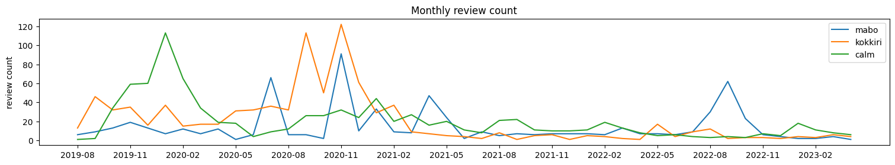
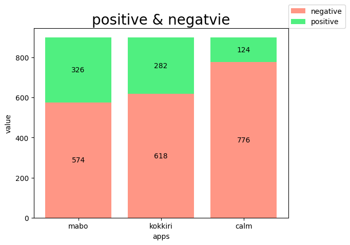
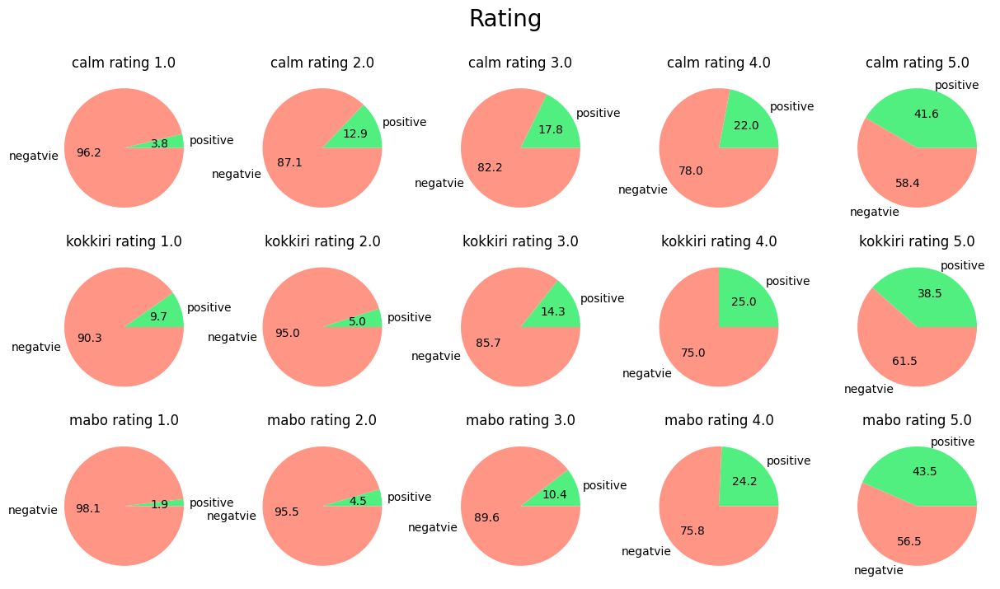

# Google PlayStore App Anaylsis

## Setting

- Python 3.8
- MacOs 12.0.^

```bash
conda install -c apple tensorflow-deps
pip install tensorflow-macos==2.9.0
pip install tensorflow-metal==0.5.0
```

# 결론

리뷰가 점수가 높을수록 긍정적인 댓글이 많다.
즉 명상앱 3가지에 대한 평점에 대한 신뢰성은 어느정도 보장 가능하다..
(머신러닝 모델이 예측을 잘하지 못해서 결과는 재미로만...)






